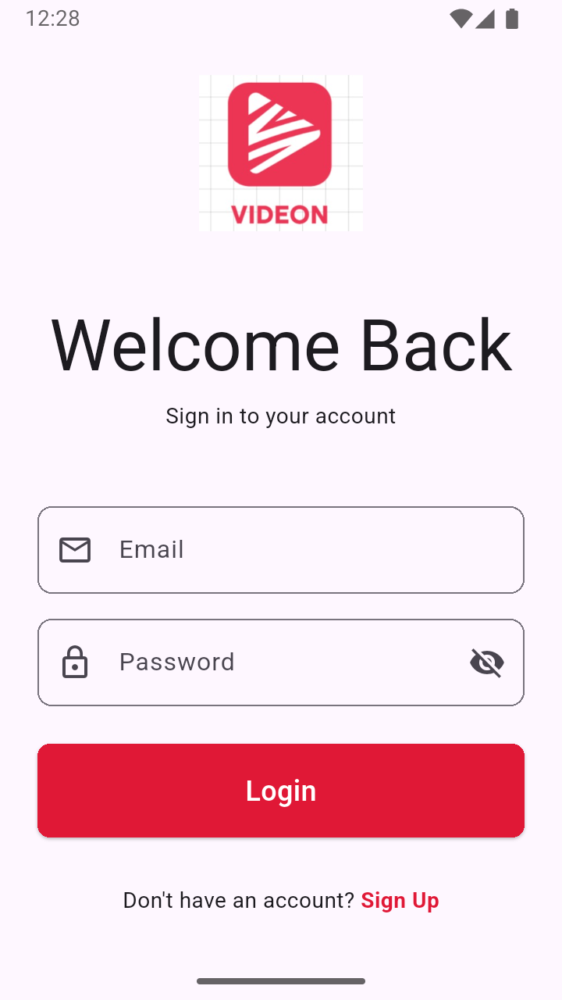
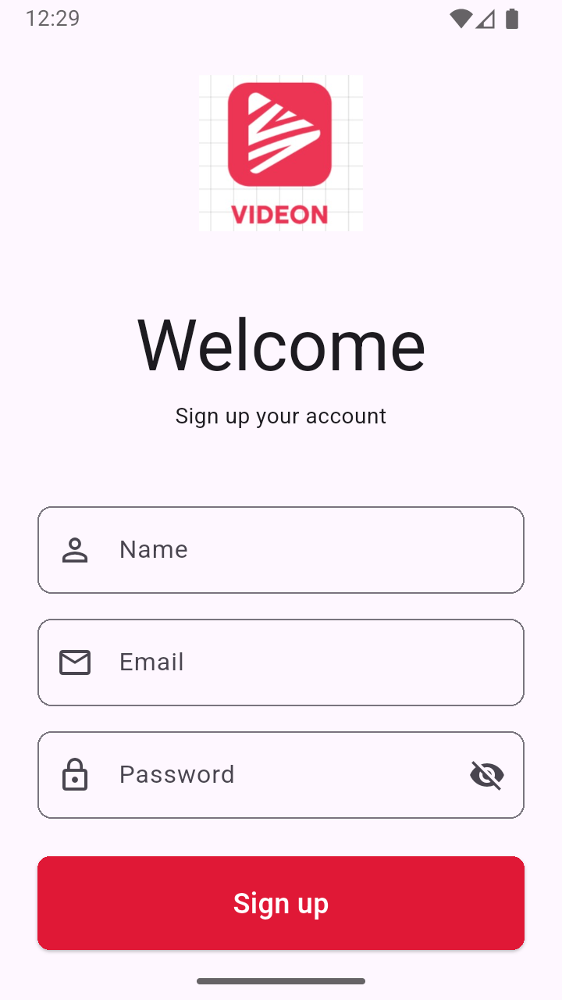
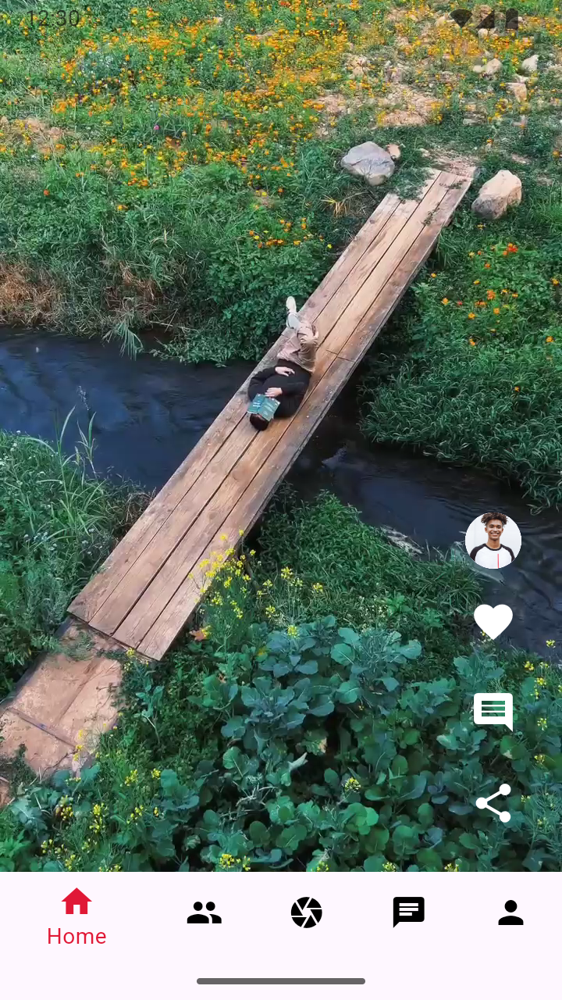
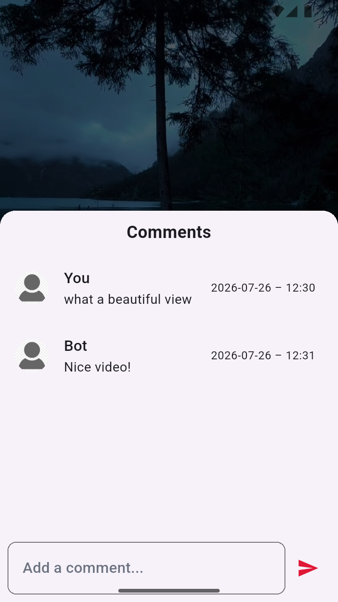
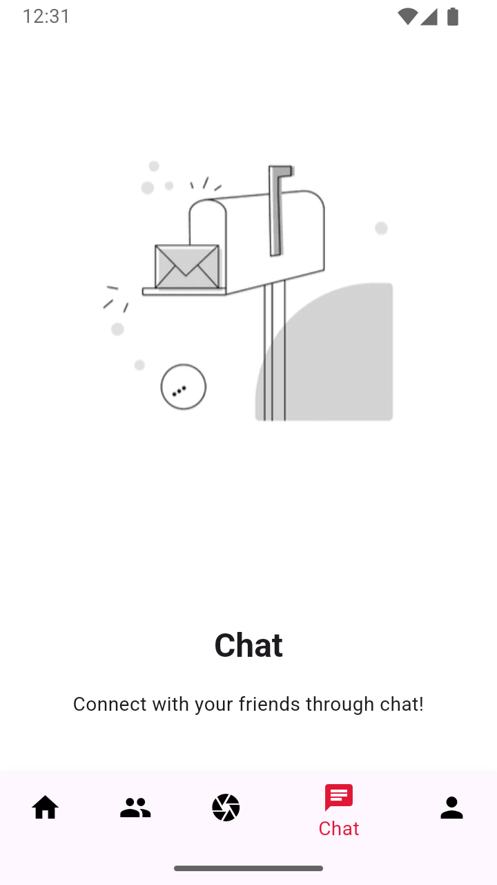

# Videon 🎥

A modern Flutter-based video feed application where users can browse an endless scroll of videos, engage through comments, and share content — built with Firebase authentication, BLoC state management, and local persistence for a smooth, native-feeling social video experience.

---

## 📱 Overview

Videon combines short-form video browsing with lightweight social interaction. Users can sign up, log in, scroll through a vertical video feed, comment on videos, and share them with friends — all while a simulated chat bot keeps the comment section lively.

The project was built to strengthen practical skills in Flutter, Firebase, state management with BLoC/Cubit, local data persistence with Hive, and scalable mobile app architecture.

---

## ✨ Key Features

### Authentication

* Email & Password Registration
* Secure Login
* Auto-Redirect to Home on Successful Login
* Firebase Authentication Integration

### Video Feed & Playback

* Vertically Scrollable Feed of 20+ Videos
* Full-Screen Video Playback with `video_player`
* Only One Video Plays at a Time (auto-pause off-screen)
* Well-Structured, Easily Indexed Video Library

### Comments & Bot Interaction

* Dedicated Comment Page/Modal per Video
* Type and Send Comments in Real Time
* Auto-Generated Bot Reply if User is Inactive for 5 Seconds
* Comments Persisted Locally with Hive, Tied to Each Video

### Sharing

* Native Share Dialog Integration via `share_plus`
* One-Tap Video Link Sharing

### State Management

* Built with **BLoC** (Cubit) to Separate Business Logic from UI
* Predictable, Testable App State

### Personalization

* Light Mode & Dark Mode Support
* Custom Reusable UI Components (Buttons, Text Fields, Dialogs)
* Responsive Design Across Screen Sizes

---

## 🛠️ Tech Stack

| Technology                | Purpose                        |
| -------------------------- | ------------------------------- |
| Flutter                    | Cross-platform UI Development   |
| Firebase Authentication    | User Authentication             |
| Hive                       | Local Key-Value Storage         |
| video_player                | Video Playback                  |
| share_plus                  | Native Share Dialog             |
| flutter_bloc (Cubit)        | State Management                |
| Dart                        | Application Logic               |

---

## 🚀 Getting Started

### Prerequisites

* Flutter SDK
* Android Studio or VS Code
* Firebase Project
* Android Emulator or Physical Device

### Installation

```bash
git clone https://github.com/HarshPeke-2004/Videon.git
cd Videon

flutter pub get

flutter run
```

---

## 🔥 Firebase Setup

1. Create a Firebase Project.
2. Enable Authentication (Email/Password).
3. Configure Firebase Storage if handling media uploads.
4. Add your platform apps (Android/iOS) to the Firebase Project.
5. Run FlutterFire configuration.

```bash
flutterfire configure
```

---

## 📸 Screenshots

Login Screen                   |   Register Screen               |   Screen 1                |   Screen 2
:-------------------------:|:-------------------------:|:-------------------------:|:-------------------------:
|||

Screen 3                   |   Screen 4                |   Screen 5                |   Screen 6
:-------------------------:|:-------------------------:|:-------------------------:|:-------------------------:
|||

---

## 🎯 Learning Outcomes

Through this project I gained experience with:

* Flutter UI Development
* Firebase Authentication Integration
* State Management with BLoC/Cubit
* Local Data Persistence with Hive
* Video Playback Handling
* Simulated Real-Time Chat/Bot Interaction
* Scalable App Architecture
* Responsive Design

---

## 📌 Future Improvements

* Push Notifications
* Cloud-Hosted Video Uploads
* Likes and Reactions
* User Following & Personalized Feed
* Search & Discovery
* Offline Video Caching
* Performance Optimization
* Web Deployment

---

## 👨‍💻 Developer

Built by [Harsh Peke](https://github.com/HarshPeke-2004) using Flutter and Firebase.
